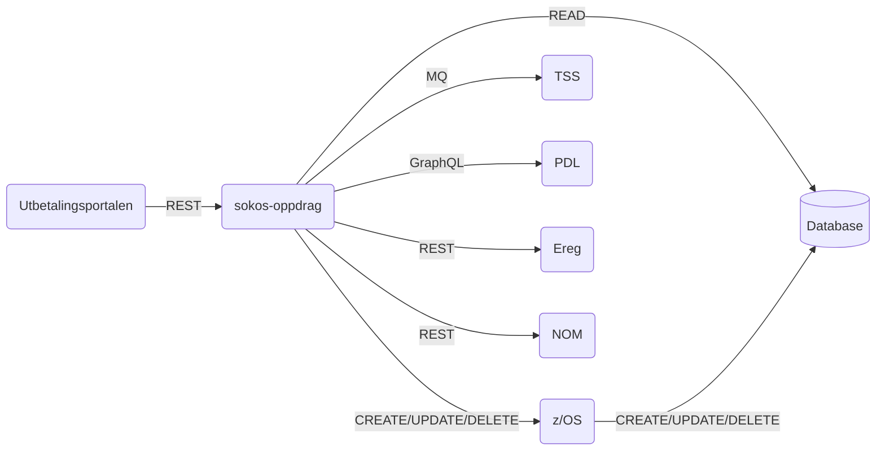

# sokos-oppdrag

* [1. Dokumentasjon](dokumentasjon/dokumentasjon.md)
* [2. Funksjonelle krav](#2-funksjonelle-krav)
* [3. Utviklingsmiljø](#3-utviklingsmiljø)
* [4. Programvarearkitektur](#4-programvarearkitektur)
* [5. Deployment](#5-deployment)
* [6. Autentisering](#6-autentisering)
* [7. Drift og støtte](#7-drift-og-støtte)
* [8. Swagger](#8-swagger)
* [9. Henvendelser](#9-henvendelser)

---

# 2. Funksjonelle Krav

Applikasjon er en proxy mellom OppdragZ og Utbetalingsportalen (intern arbeidsflate).

# 3. Utviklingsmiljø

### Forutsetninger

* Java 25
* [Gradle](https://gradle.org/)
* [Kotest IntelliJ Plugin](https://plugins.jetbrains.com/plugin/14080-kotest)
* [Docker](https://www.docker.com/)
    * for å starte opp en Valkey server lokalt
    * for å kjøre testcontainers

### Bygge prosjekt

`./gradlew build installDist`

### Lokal utvikling

Pass på at hosts-fila inneholder følgende linjer hvis du sitter på egen pc(trengs ikke i VDI):

```
10.53.17.144    mqlclient02.preprod.local
10.53.17.117    mqls01.preprod.local
10.53.17.118    mqls02.preprod.local
10.53.17.119    mqls03.preprod.local
```

Vi gjenbruker Testcontainers. Derfor trengs en setting for at det skal kunne fungere ordentlig:
Legg til testcontainers.reuse.enable=true i filen `~/.testcontainers.properties`. 

Kjør `./setupLocalEnvironment.sh` for å sette opp prosjektet lokalt.

Kjør `docker-compose up -d` for å starte opp en Valkey server lokalt.

Applikasjonen trenger en db2 lisens fil for å koble til DB2 lokalt. Kontakt en utvikler fra Team Motta og beregne for å få denne filen.

### Database

For å koble til databasen bør man også ha et innslag i hosts-fila(frivillig, man kan benytte ip-adressen om man foretrekker det):

155.55.1.82   ztest.test.local

Database-url er jdbc:db2://ztest.test.local:5025/QDB2 og skjema for Q0 er OS231Q0

Man må ha samme lisensfil som man trenger for å starte applikasjonen bundlet med i driveren 

Innlogging er trebokstavs-ident(som man finner om man søker seg selv opp på Navet/Sharepoint) og samme passord som man trenger for å logge inn i stormaskin. 
Hvis det står at passordet og brukernavnet ikke er gyldig, så kan man logge inn i NAV Webapplikasjoner(https://felgen.ansatt.nav.no), 
gå inn i Applikasjonsportalen og starte "Datasentral utvidet". Får man logget inn der, er brukernavnet og passordet gyldig. 

Passordet må byttes ved jevne mellomrom, og man får et varsel om det i Datasentral utvidet, og mulighet til å bytte til nytt passord der.

# 4. Programvarearkitektur



# 5. Deployment

Distribusjon av tjenesten er gjort med bruk av Github Actions.
[sokos-oppdrag CI / CD](https://github.com/navikt/sokos-oppdrag/actions)

Push/merge til main branch direkte er ikke mulig. Det må opprettes PR og godkjennes før merge til main branch.
Når PR er merged til main branch vil Github Actions bygge og deploye til dev-fss og prod-fss.
Har også mulighet for å deploye manuelt til testmiljø ved å deploye PR.

# 6. Autentisering

Applikasjonen bruker [AzureAD](https://docs.nais.io/security/auth/azure-ad/) autentisering.
Applikasjonen brukes av [Utbetalingsportalen](https://github.com/navikt/sokos-utbetalingsportalen) og derfor brukes det OBO-token
som må genereres for å teste mot dev-miljøet.

# 7. Drift og støtte

### Logging

Feilmeldinger og infomeldinger som ikke innheholder sensitive data logges til [Grafana Loki](https://docs.nais.io/observability/logging/#grafana-loki).  
Sensitive meldinger logges til [Team Logs](https://doc.nais.io/observability/logging/how-to/team-logs/).

### Kubectl

For dev-gcp:

```shell script
kubectl config use-context dev-fss
kubectl get pods -n okonomi | grep sokos-oppdrag
kubectl logs -f sokos-oppdrag-<POD-ID> --namespace okonomi -c sokos-oppdrag
```

For prod-gcp:

```shell script
kubectl config use-context prod-fss
kubectl get pods -n okonomi | grep sokos-oppdrag
kubectl logs -f sokos-oppdrag-<POD-ID> --namespace okonomi -c sokos-oppdrag
```

### Alarmer

Applikasjonen bruker [Grafana Alerting](https://grafana.nav.cloud.nais.io/alerting/) for overvåkning og varsling.
Dette er konfigurert via NAIS sin [alerting-integrasjon](https://doc.nais.io/observability/alerts).

Alarmene overvåker metrics som:

- HTTP-feilrater
- JVM-metrikker

Varsler blir sendt til følgende Slack-kanaler:

- Dev-miljø: [#team-mob-alerts-dev](https://nav-it.slack.com/archives/C042SF2FEQM)
- Prod-miljø: [#team-mob-alerts-prod](https://nav-it.slack.com/archives/C042ESY71GX)

### Grafana

- [sokos-oppdrag](https://grafana.nav.cloud.nais.io/d/fds82z8c0pq0wf/sokos-oppdrag?orgId=1)

---

# 8. Swagger

Integration:

- [Prod-fss](https://sokos-oppdrag.intern.nav.no/api/v1/integration/docs)
- [Dev-fss](https://sokos-oppdrag.intern.dev.nav.no/api/v1/integration/docs)
- [Lokalt](http://0.0.0.0:8080/api/v1/integration/docs)

Oppdragsinfo:

- [Prod-fss](https://sokos-oppdrag.intern.nav.no/api/v1/oppdragsinfo/docs)
- [Dev-fss](https://sokos-oppdrag.intern.dev.nav.no/api/v1/oppdragsinfo/docs)
- [Lokalt](http://0.0.0.0:8080/api/v1/oppdragsinfo/docs)

Attestasjon:

- [Prod-fss](https://sokos-oppdrag.intern.nav.no/api/v1/attestasjon/docs)
- [Dev-fss](https://sokos-oppdrag.intern.dev.nav.no/api/v1/attestasjon/docs)
- [Lokalt](http://0.0.0.0:8080/api/v1/attestasjon/docs)

# 9. Henvendelser

Spørsmål knyttet til koden eller prosjektet kan stilles som issues her på Github.
Interne henvendelser kan sendes via Slack i kanalen [#utbetaling](https://nav-it.slack.com/archives/CKZADNFBP)

