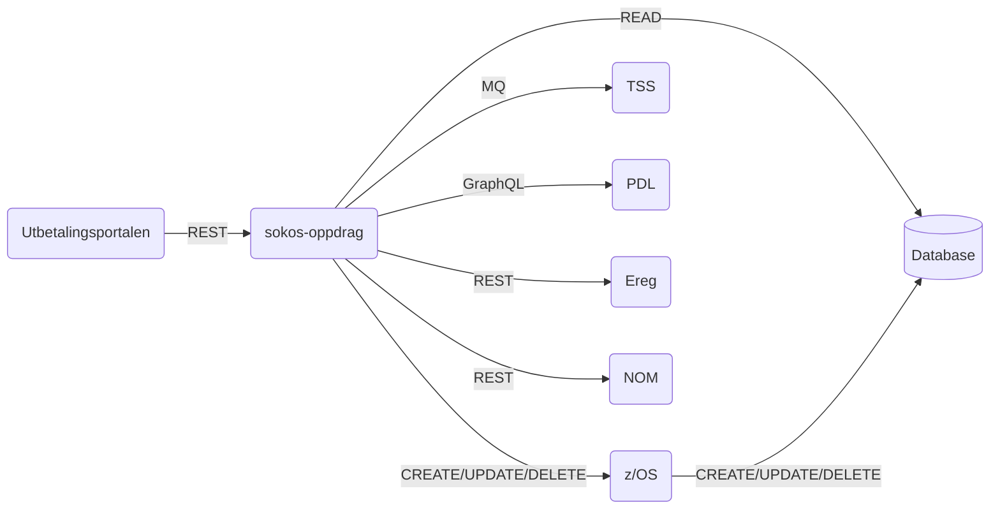

---
sokos-oppdrag
---

```mermaid
flowchart LR
    up("Utbetalingsportalen")
    so("sokos-oppdrag")
    zos("z/OS")
    db2[(Database)]
    tss("TSS")
    pdl("PDL")
    ereg("Ereg")
    nom("NOM")
    up --> |REST| so
    so --> |READ| db2
    so --> |CREATE/UPDATE/DELETE| zos
    so --> |MQ| tss
    so --> |GraphQL| pdl
    so --> |REST| ereg
    so --> |REST| nom
    zos --> |CREATE/UPDATE/DELETE| db2
```